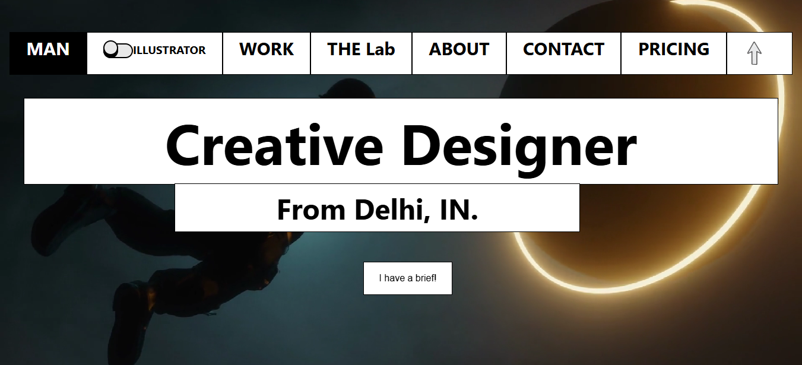

# 🎨 Graphic Designer Portfolio – HTML, CSS & JavaScript

## 🚀 Overview

Showcase your creativity and professional design work with this **modern, responsive portfolio website** built using **HTML**, **CSS**, and **JavaScript**.  
This project is designed to present your skills and personality in a clean, engaging way — perfect for attracting clients and collaborators.

---

## 🌟 Features

- 🎯 **Creative & Minimal Design** – Bold typography, balanced spacing, and clean layout for maximum visual impact.
- 🖼 **Project Showcase Categories** – Organize work by types such as *Logos*, *Magazines*, *Banners*, *Brand Style Guides*, *Animated Posters*, and more.
- ✨ **Interactive Navigation** – Smooth scrolling and intuitive navigation for easy access to portfolio sections.
- 📱 **Fully Responsive** – Designed with **Flexbox** and **Grid** to adapt seamlessly across desktop, tablet, and mobile.
- 💬 **Client Testimonials** – Showcase reviews like:  
  > “This guy is a real pro! I've never seen anything like it in 25 years of graphic design!”
- 🧪 **The Lab Section** – A space for creative experiments and daily graphic work to push creative boundaries.
- 📩 **Contact & Imprint** – Display location, email, and phone for quick communication.

---

## 🛠️ Tech Stack

- **HTML5** – Structured, semantic markup
- **CSS3** – Custom styling with Grid, Flexbox, and animations
- **JavaScript (Vanilla)** – For interactivity and smooth effects

---

## 📚 What You'll Learn

- Structuring a **creative portfolio website** for maximum impact
- Organizing projects by categories with visual appeal
- Implementing a **fully responsive layout** using CSS Grid and Flexbox
- Adding **JavaScript interactivity** for improved UX
- Maintaining a **professional yet personal brand identity** online

---

## 🧩 Use Cases

- Your official **graphic design portfolio**
- Showcasing creative experiments & branding projects
- A hub to present designs for **websites, cards, logos, T-shirts, magazines**, and more
- A personal link for **recruiters, agencies, or clients**

---

## 📁 Project Structure
/img/                  # Folder containing images used across the site
/video/                # Folder containing video files (portfolio work)

/alex.css              # Additional CSS styling (possibly theme-specific)
app.js                 # Main JavaScript functionality

contact.html           # Contact page with form and contact info
index.html             # Homepage
pricing.html           # Pricing details for services
products.html          # Showcase of products or portfolio items

README.md              # Project documentation (this file)

